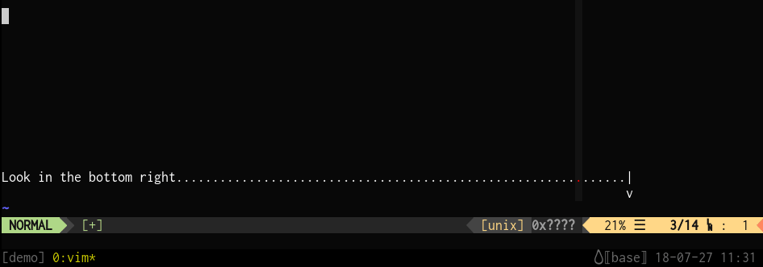

`kb_mode`
=========
This utility is used to display the mode or layer of a keyboard.

Demo
----
In this demo I am changing layers on my keyboard and the current layer is
reflected in my tmux status bar, in the bottom right, to the left of the
date+time.

How does it work?
-----------------

1. Keyboard firmware (such as [QMK firmware](https://github.com/qmk/qmk_firmware))
   writes layer information to HID in the form of `Layer: layer_name`.
2. `hid_listen` read HID data on the host side.
3. This data is piped into `kb_mode` which extracts the layer name / string.
4. `kb_mode` writes the layer name to a specified file.
5. A utility such as a window manager, shell, editor, tmux/screen, etc. reads
   the file and displays the layer name to the user.

The `kb_mode` is setup to recognize the layers I care about - it is only
extensible by changing the C code.  The concept is simple though, one could
write their own tool in any scripting language.

Why not modify `hid_listen`?
----------------------------
I considered modifying `hid_listen` directly, but decided against it bolting the
way in which `hid_listen` processes the data makes it a bit messy to bolt on
this functionality.  Adding a second tool that consumes the output of
`hid_listen` seemed simpler, cleaner, and more unix-ey.
